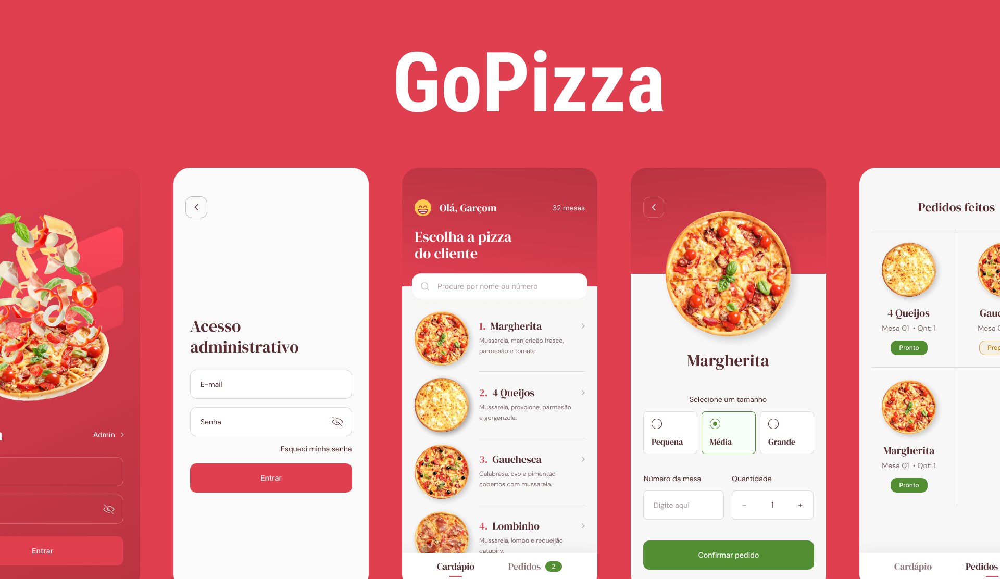

<h1 align="center"> GoPizza </h1>

GoPizza ignite
  

  <a href="#-tecnologias">Tecnologias</a>&nbsp;&nbsp;&nbsp;|&nbsp;&nbsp;&nbsp;
  <a href="#-projeto">Projeto</a>&nbsp;&nbsp;&nbsp;|&nbsp;&nbsp;&nbsp;
  <a href="#-layout">Layout</a>&nbsp;&nbsp;&nbsp;|&nbsp;&nbsp;&nbsp;
  <a href="#memo-licença">Licença</a>

  

 

## 🚀 Tecnologias

Esse projeto foi desenvolvido com as seguintes tecnologias:

- React Native
- Expo
- styled-components
- Firebase
- RealTime
- JavaScript
- Git e Github

## 💻 Projeto

Esta é uma aplicação completa para auxiliar Garçons
 de uma Pizzaria. Nesse App o Administrador cadastra o cardápio de pizzas e o 
Garçom anota o pedido do cliente e acompanha o processo de preparação da Pizza.
 Nesta aplicação utilizamos banco de dados Realtime com o Firestore,
 Autenticação e Storage do Firebase para armazenar imagens. Também vamos utilizar
 Expo com Bare Workflow, Typescript, Styled Components e mais.

## 🎨 Layout

